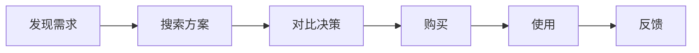

# 用户画像与用户旅程图 MVP 设计

## 1. 目标

为每日产品机会报告增加可追溯的匿名聚合用户洞察。仅对满足门槛的产品机会输出：

- 用户画像：使用场景、核心目标、高频痛点、购买触发点、顾虑、证据与置信度。
- 用户旅程图：发现需求、搜索方案、对比决策、购买、使用、反馈六个阶段。

该能力帮助产品经理把社媒热点、用户痛点和亚马逊评论转为可核验的产品定义输入；不识别、不推断或不保存任何个人身份信息。

## 2. MVP 范围

### 2.1 纳入范围

- 在每日 Markdown 报告和飞书推送正文中展示高分机会的用户画像与用户旅程图。
- 使用已采集的 `SocialRecord`、`ReviewRecord` 与 `Opportunity` 进行确定性聚合。
- 输出 Mermaid 流程图和可点击的公开社媒证据链接。
- 支持通过配置控制分数门槛、每日报告上限和最低证据数量。
- 为画像、旅程、报告渲染及 CLI 集成提供自动化测试。

### 2.2 不纳入范围

- 不新增任何社媒采集接口，不修改 Apify、ScrapeCreators、PRAW 或亚马逊评论脚本。
- 不调用 LLM，不进行黑盒推断，不生成个人心理画像。
- 不引入前端、数据库、账号体系或单独的可视化服务。
- 不复制或重新发布外部 GitHub 项目的代码、素材或数据。
- 不将 PII、用户名、用户主页、邮箱或其他可识别个人的数据写入报告。

## 3. 启用规则与配置

在 `config/sources.example.yaml` 和实际配置中增加：

```yaml
persona_journey:
  min_opportunity_score: 60
  max_opportunities_per_report: 3
  min_evidence_count: 2
```

规则如下：

1. 仅选择 `Opportunity.total_score >= 60` 的机会。
2. 按总分从高到低排序，最多处理 3 个。
3. 每个机会的画像与旅程均按去重后的有效公开社媒 URL 计数。
4. 有效 URL 少于 2 条时，输出低置信度与证据不足提示；不得给出确定性用户结论。
5. 配置值必须为正整数；`min_opportunity_score` 必须在 0 到 100 之间。非法配置在 CLI 启动时明确报错。

## 4. 数据边界与证据规则

### 4.1 输入

| 数据 | 用途 | 可用于链接证据 |
| --- | --- | --- |
| `Opportunity` | 机会标题、类目、评分、痛点、产品建议、风险 | 否 |
| `SocialRecord` | 标题、正文、评论、互动、标签、平台、公开 URL | 是 |
| `ReviewRecord` | 评论标题、正文、评分 | 否，仅作为痛点补充 |

### 4.2 证据归属

- 机会按类目关联对应的 `SocialRecord`，并按 URL 去重。
- 仅接受以 `http://` 或 `https://` 开头的 URL 作为公开链接证据。
- 亚马逊评论可补充使用阶段与反馈阶段的痛点，但不能计入公开 URL 数量。
- 报告只展示平台、URL 和短摘要，不展示作者、账号、头像或可识别个人信息。
- 每条核心结论至少附一条证据链接；证据不足时使用“待验证”“信号有限”等中性表达。

### 4.3 置信度

| 条件 | 置信度 | 输出约束 |
| --- | --- | --- |
| 有效 URL 少于 2 条 | 低 | 仅展示观察到的信号与待验证项 |
| 有效 URL 至少 2 条，且痛点存在重复信号 | 中 | 可输出聚合倾向，需附链接 |
| 有效 URL 至少 4 条，且至少 2 个平台出现一致痛点 | 高 | 可输出较稳定的聚合洞察，需附链接 |

## 5. 模块设计

新增模块与职责：

| 模块 | 职责 |
| --- | --- |
| `src/radar/persona_builder.py` | 从机会、社媒记录和评论中生成匿名聚合用户画像 |
| `src/radar/journey_builder.py` | 从相同证据中生成六阶段用户旅程 |
| `src/radar/models.py` | 增加画像、旅程阶段、证据与组合结果的数据模型 |
| `src/radar/reports.py` | 在每日 Markdown 中渲染画像、Mermaid 图和链接证据 |
| `src/radar/cli.py` | 读取配置，筛选高分机会并将结果交给报告生成器 |

不修改采集器、机会评分器、飞书消息分片与发送逻辑。飞书继续复用现有 Markdown 文本发送路径。

## 6. 数据模型

建议新增以下不可变数据结构：

```python
PersonaEvidence(
    platform: str,
    url: str,
    summary: str,
)

UserPersona(
    opportunity_title: str,
    category: str,
    opportunity_score: int,
    scenario: str,
    core_goal: str,
    pain_points: tuple[str, ...],
    purchase_triggers: tuple[str, ...],
    concerns: tuple[str, ...],
    evidence: tuple[PersonaEvidence, ...],
    confidence: str,
)

JourneyStage(
    name: str,
    observed_signals: tuple[str, ...],
    user_need_or_action: str,
    product_implication: str,
    evidence_urls: tuple[str, ...],
    confidence: str,
)

PersonaJourneyResult(
    persona: UserPersona,
    stages: tuple[JourneyStage, ...],
)
```

模型只保存聚合后的文本、平台和公开 URL；不得新增用户身份字段。

## 7. 确定性生成规则

MVP 不使用 AI。生成过程必须可重复、可审计：

1. 依据机会类目收集对应社媒记录和评论记录。
2. 规范化文本并按 URL 去重，过滤空文本和非公开 URL。
3. 使用项目内置的、可见的中文关键词词表归类信号：
   - 痛点：不便、占空间、难清洁、易坏、漏水、噪音、尺寸不合、安装困难等。
   - 触发点：搬家、换新、节日、厨房改造、收纳不足、送礼等。
   - 顾虑：价格、耐用性、安全、清洁、尺寸、售后、兼容性等。
4. 使用类目名称、机会痛点和已命中的信号组合成中性、聚合的画像字段。
5. 为六个旅程阶段映射证据：

| 阶段 | 主要信号 | 产出 |
| --- | --- | --- |
| 发现需求 | 痛点、生活场景、抱怨 | 需求出现的情境 |
| 搜索方案 | 搜索、求推荐、关键词、替代品 | 用户寻找的解决方向 |
| 对比决策 | 对比、价格、尺寸、功能、材质 | 决策标准和阻碍 |
| 购买 | 下单、预算、促销、送礼 | 购买触发点 |
| 使用 | 安装、清洁、收纳、体验、故障 | 使用中的关键体验 |
| 反馈 | 评价、复购、退货、推荐、吐槽 | 反馈与改进机会 |

6. 某阶段没有直接证据时，写明“当前未发现直接公开证据，待后续采集验证”，不填充臆测内容。
7. 依据第 4.3 节规则计算置信度，并在画像和每个阶段中一致呈现。

## 8. 报告输出

在现有“产品机会排序”之后，新增：

````markdown
## 用户画像与用户旅程图

### {机会标题}（{总分}分）

#### 用户画像
- 典型使用场景：...
- 核心目标：...
- 高频痛点：...
- 购买触发点：...
- 主要顾虑：...
- 置信度：中（公开证据 3 条）

证据：
- [Reddit](https://example.com/...)
- [小红书](https://example.com/...)

#### 用户旅程图



| 阶段 | 已观察到的信号 | 产品启示 | 证据 |
| --- | --- | --- | --- |
| 发现需求 | ... | ... | [链接](https://example.com/...) |
````

要求：

- 同一机会最多展示 5 条去重证据链接，避免报告和飞书消息过长。
- 链接文本只使用平台名或“证据 N”，不包含个人账号信息。
- 低置信度时增加“需补充至少 2 条公开社媒证据后再形成用户结论”。
- 没有合格机会时，整个章节不出现，现有报告结构保持不变。

## 9. CLI 与兼容性

- 不新增必填 CLI 参数。
- `python -m radar.cli --use-sample-data` 必须能够生成包含或不包含画像章节的有效报告。
- 默认真实运行和 `--send-feishu` 的行为保持不变；画像章节被视为普通报告正文，继续使用既有安全分片逻辑。
- 报告构建函数新增可选参数，并提供默认值，避免破坏现有调用和测试。
- 采集失败、没有社媒记录、无有效 URL 或配置缺失时，不应中断机会评分和日报生成。

## 10. 测试与验收

### 10.1 单元测试

- 分数等于 60 的机会会进入候选；59 分不会进入。
- 候选按总分排序，每份报告最多生成 3 个画像与旅程结果。
- URL 去重、无效 URL 过滤和最多 5 条展示限制正确。
- 少于 2 条有效 URL 时为低置信度，且输出待验证措辞。
- 跨至少两个平台、四条以上一致证据时为高置信度。
- 六个阶段顺序固定，缺失证据阶段使用中性待验证文本。
- 报告包含 Mermaid、中文标题与可点击链接。
- 无合格机会时报告不出现新章节。
- 原有报告、飞书、评分、采集器测试全部保持通过。

### 10.2 本地验收命令

```powershell
cd E:\vscode\amazon-social-opportunity-radar
python -m pytest -q
python -m ruff check src tests
python -m radar.cli --use-sample-data --output-dir outputs
```

验收结果应包括：全部测试通过、静态检查通过、示例日报成功生成，且当示例证据不足时明确标识为低置信度。

## 11. 开发顺序

1. 扩展数据模型和配置读取，并先补充失败测试。
2. 实现证据筛选、画像生成和旅程生成的纯函数。
3. 将结果接入 Markdown 报告，不改变现有章节。
4. 接入 CLI 筛选和日报参数。
5. 跑完整测试、静态检查和示例 CLI 验收。
6. 在不包含内部开发文档的前提下，将功能代码、测试、公开说明同步到 GitHub。

## 12. 风险与后续迭代

| 风险 | MVP 处理方式 | 后续方向 |
| --- | --- | --- |
| 证据不足导致结论失真 | 低置信度与待验证提示，不输出确定性结论 | 增加跨日信号聚合 |
| 关键词误判 | 关键词词表可见、测试覆盖典型场景 | 维护类目词表与人工抽检 |
| 飞书正文过长 | 每机会最多 5 条证据、最多 3 个机会 | 生成独立详情页或附件 |
| 隐私与合规 | 匿名聚合，不保留身份数据 | 增加敏感字段检测 |
| 图表兼容性 | Mermaid 作为 Markdown 代码块保留 | 后续按客户端能力增加图片渲染 |

## 13. 完成定义

当满足以下条件时，MVP 视为完成：

- 高分机会按配置稳定生成匿名用户画像和六阶段用户旅程图。
- 每个核心结论具有可点击、去重的公开证据，或明确标记为待验证。
- 不产生个人画像、身份数据或新的采集请求。
- 现有采集、评分、报告、飞书功能无回归。
- 自动化测试、静态检查和示例 CLI 均通过。
